# Project P1-Finding the lane lines

This project is to identify the lane lines on the road. It helps to learn the following concepts
- Color Selection
- Region Masking
- Gaussian Blur
- Canny Edge detection
- Hough transform


```python
#importing some useful packages
import matplotlib.pyplot as plt
import matplotlib.image as mpimg
import numpy as np
import cv2
%matplotlib inline
```

## Step 1: Read Image


```python
#reading in an image
image = mpimg.imread('test_images/solidWhiteRight.jpg')

#printing out some stats and plotting
print('This image is:', type(image), 'with dimensions:', image.shape)
plt.imshow(image)  # if you wanted to show a single color channel image called 'gray', for example, call as plt.imshow(gray, cmap='gray')
```

    This image is: <class 'numpy.ndarray'> with dimensions: (540, 960, 3)
    


    <matplotlib.image.AxesImage at 0x182bf2e5608>


    
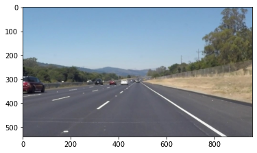
    


## Step 2: Convert the image to Grayscale


```python
def grayscale(img):
    '''
    Applies the Grayscale transform.
    '''
    return cv2.cvtColor(img, cv2.COLOR_RGB2GRAY)
```


```python
gray_img = grayscale(image)
plt.imshow(gray_img, cmap = 'gray')
```


    <matplotlib.image.AxesImage at 0x182bfdb3108>


    

    


## Step 3: Apply a Gaussian Noise Kernel


```python
def gaussian_blur(img, kernel_size):
    """Applies a Gaussian Noise kernel"""
    return cv2.GaussianBlur(img, (kernel_size, kernel_size), 0)
```


```python
blur_gray = gaussian_blur(gray_img, kernel_size = 5)
plt.imshow(blur_gray, cmap='gray')
```


    <matplotlib.image.AxesImage at 0x182bfe22888>


    
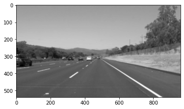
    


## Step 4: Apply Canny Transform


```python
def canny(img, low_threshold, high_threshold):
    """Applies the Canny transform"""
    return cv2.Canny(img, low_threshold, high_threshold)
```


```python
edges = canny(blur_gray, 40, 160)
plt.imshow(edges, cmap='gray')
```


    <matplotlib.image.AxesImage at 0x182bfe917c8>


    
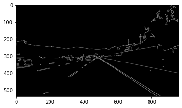
    


## Step 5: ROI - Apply Regional Mask


```python
def region_of_interest(img):
    """
    Applies an image mask.
    
    Only keeps the region of the image defined by the polygon
    formed from `vertices`. The rest of the image is set to black.
    `vertices` should be a numpy array of integer points.
    """
    #defining a blank mask to start with
    mask = np.zeros_like(img)   
    
    vertices = np.array([[(0,edges.shape[0]),(500, 320), (490, 320), (edges.shape[1],edges.shape[0])]], dtype=np.int32)
    #defining a 3 channel or 1 channel color to fill the mask with depending on the input image
    if len(img.shape) > 2:
        channel_count = img.shape[2]  # i.e. 3 or 4 depending on your image
        ignore_mask_color = (255,) * channel_count
    else:
        ignore_mask_color = 255
        
    #filling pixels inside the polygon defined by "vertices" with the fill color    
    cv2.fillPoly(mask, vertices, ignore_mask_color)
    
    #returning the image only where mask pixels are nonzero
    masked_image = cv2.bitwise_and(img, mask)
    return masked_image
```


```python
masked_edges = region_of_interest(edges)
plt.imshow(masked_edges)
```


    <matplotlib.image.AxesImage at 0x182bfee24c8>


    
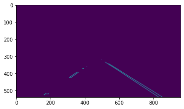
    


## Step 6: Apply Hough Transform


```python
def hough_lines(img, rho = 2, theta = np.pi/180, threshold = 19, min_line_len = 24, max_line_gap = 20):
    """
    `img` should be the output of a Canny transform.
        
    Returns an image with hough lines drawn.
    """
    lines = cv2.HoughLinesP(img, rho, theta, threshold, np.array([]), minLineLength=min_line_len, maxLineGap=max_line_gap)
    line_img = np.zeros((img.shape[0], img.shape[1], 3), dtype=np.uint8)
    #draw_lines(line_img, lines)
    return lines
```


```python
lines = hough_lines(masked_edges)
print(*lines)
```

    [[498 320 796 514]] [[538 342 853 539]] [[310 422 355 392]] [[318 425 363 394]] [[800 518 832 538]] [[310 423 358 392]] [[715 462 765 494]] [[750 485 782 505]] [[522 335 696 448]] [[546 346 854 538]] [[319 424 363 392]]
    

## Step 7: Draw Lines


```python
def draw_lines(lines, image):
    
    lane_image = np.copy(image)*0 #creating a blank to draw lines on
    lane_color = (255,0,0)
    lane_thickness = 10
    
    left_slopes = []
    left_intercepts = []
    
    right_slopes = []
    right_intercepts = []
    
    y_max = image.shape[0]
    y_min = lane_image.shape[0]
    
    for line in lines:
        for x1,y1,x2,y2 in line:
            m, b = np.polyfit((x1, x2), (y1, y2), 1)
            y_min = min(y_min, y1, y2)
            if(m > 0):
                left_slopes.append(m)
                left_intercepts.append(b)
            if(m < 0):
                right_slopes.append(m)
                right_intercepts.append(b)
                
    if len(left_slopes) > 0: 
        # Draw the left lane
        left_slope = np.median(left_slopes)
        left_intercept = np.median(left_intercepts)
        left_x_min = int((y_min-left_intercept)/left_slope)
        left_x_max = int((y_max-left_intercept)/left_slope)
        cv2.line(lane_image, (left_x_min, y_min), (left_x_max, y_max), lane_color, lane_thickness)
    if len(right_slopes) > 0:
        # Draw the right lane
        right_slope = np.median(right_slopes)
        right_intercept = np.median(right_intercepts)
        right_x_min = int((y_min-right_intercept)/right_slope)
        right_x_max = int((y_max-right_intercept)/right_slope)
        cv2.line(lane_image, (right_x_min, y_min), (right_x_max, y_max), lane_color, lane_thickness)
    
    return cv2.addWeighted(image, 0.8, lane_image, 1, 0)
```


```python
lanes = draw_lines(lines, image)
plt.imshow(lanes)
```


    <matplotlib.image.AxesImage at 0x182bff6e948>


    
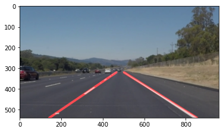
    


## Step 8: Final Solution Pipeline


```python
def pipeline(image):
    gray = grayscale(image)
    blur_gray = gaussian_blur(gray, kernel_size = 5)
    edges = canny(blur_gray, 50, 150)
    masked_edges = region_of_interest(edges)
    lines = hough_lines(masked_edges)
    
    return draw_lines(lines, image)
```

## Step 9: Test the pipeline on the test images

### Test Images

Build your pipeline to work on the images in the directory "test_images"
You should make sure your pipeline works well on these images before you try the videos.


```python
import os
test_images = os.listdir("test_images/")
```

### Test the pipeline


```python
if not os.path.isdir("test_images_output"):
    os.mkdir("test_images_output")

for i in range(0, len(test_images)):
    # Read image
    img = mpimg.imread(os.path.join("test_images", test_images[i]))
    # Run the pipeline
    img_out = pipeline(img)
    # Save output
    mpimg.imsave(os.path.join("test_images_output/", test_images[i]), img_out)
    # Show output
    plt.figure()
    plt.suptitle(test_images[i], fontsize=20)
    plt.imshow(img_out)
```


    
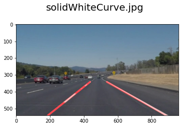
    


    
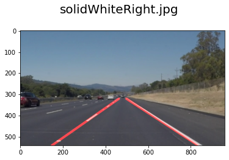
    


    
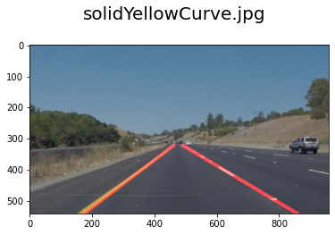
    


    
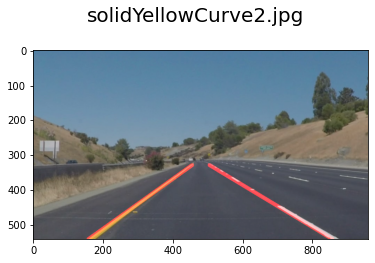
    


    
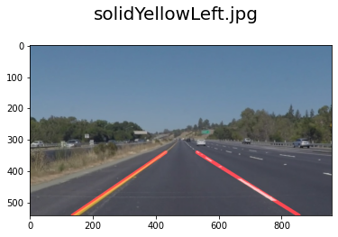
    


    
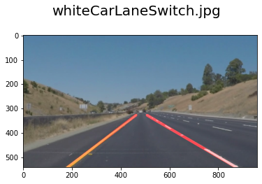
    


## Step 10: Test on Videos

Below code tests the pipeline for the videos in `test_videos` and stores the output in `test_videos_output` 


```python
# Import everything needed to edit/save/watch video clips
!pip install moviepy
from moviepy.editor import VideoFileClip
# from moviepy.editor import *
from IPython.display import HTML
def process_image(image):
    # NOTE: The output you return should be a color image (3 channel) for processing video below
    # TODO: put your pipeline here,
    # you should return the final output (image where lines are drawn on lanes)
    result = pipeline(image)
    return result
```

    Requirement already satisfied: moviepy in c:\users\hp\anaconda3\lib\site-packages (1.0.3)
    Requirement already satisfied: requests<3.0,>=2.8.1 in c:\users\hp\anaconda3\lib\site-packages (from moviepy) (2.25.1)
    Requirement already satisfied: numpy>=1.17.3 in c:\users\hp\anaconda3\lib\site-packages (from moviepy) (1.20.2)
    Requirement already satisfied: imageio<3.0,>=2.5 in c:\users\hp\anaconda3\lib\site-packages (from moviepy) (2.9.0)
    Requirement already satisfied: decorator<5.0,>=4.0.2 in c:\users\hp\anaconda3\lib\site-packages (from moviepy) (4.4.2)
    Requirement already satisfied: imageio-ffmpeg>=0.2.0 in c:\users\hp\anaconda3\lib\site-packages (from moviepy) (0.4.4)
    Requirement already satisfied: tqdm<5.0,>=4.11.2 in c:\users\hp\anaconda3\lib\site-packages (from moviepy) (4.61.1)
    Requirement already satisfied: proglog<=1.0.0 in c:\users\hp\anaconda3\lib\site-packages (from moviepy) (0.1.9)
    Requirement already satisfied: pillow in c:\users\hp\anaconda3\lib\site-packages (from imageio<3.0,>=2.5->moviepy) (8.2.0)
    Requirement already satisfied: idna<3,>=2.5 in c:\users\hp\anaconda3\lib\site-packages (from requests<3.0,>=2.8.1->moviepy) (2.10)
    Requirement already satisfied: urllib3<1.27,>=1.21.1 in c:\users\hp\anaconda3\lib\site-packages (from requests<3.0,>=2.8.1->moviepy) (1.26.4)
    Requirement already satisfied: certifi>=2017.4.17 in c:\users\hp\anaconda3\lib\site-packages (from requests<3.0,>=2.8.1->moviepy) (2021.5.30)
    Requirement already satisfied: chardet<5,>=3.0.2 in c:\users\hp\anaconda3\lib\site-packages (from requests<3.0,>=2.8.1->moviepy) (4.0.0)
    


```python
white_output = 'test_videos_output/solidWhiteRight.mp4'
clip1 = VideoFileClip("test_videos/solidWhiteRight.mp4")
white_clip = clip1.fl_image(process_image) #NOTE: this function expects color images!!
white_clip  
%time white_clip.write_videofile(white_output, audio=False)
# white_clip.write_videofile(white_output, audio=False)
```

    t:   0%|          | 0/221 [00:00<?, ?it/s, now=None]

    Moviepy - Building video test_videos_output/solidWhiteRight.mp4.
    Moviepy - Writing video test_videos_output/solidWhiteRight.mp4
    
    

                                                                  

    Moviepy - Done !
    Moviepy - video ready test_videos_output/solidWhiteRight.mp4
    Wall time: 7.96 s
    


```python
HTML("""
<video width="960" height="540" controls>
  <source src="{0}">
</video>
""".format(white_output))
```


<video width="960" height="540" controls>
  <source src="test_videos_output/solidWhiteRight.mp4">
</video>


```python
yellow_output = 'test_videos_output/solidYellowLeft.mp4'
## To speed up the testing process you may want to try your pipeline on a shorter subclip of the video
## To do so add .subclip(start_second,end_second) to the end of the line below
## Where start_second and end_second are integer values representing the start and end of the subclip
## You may also uncomment the following line for a subclip of the first 5 seconds
##clip2 = VideoFileClip('test_videos/solidYellowLeft.mp4').subclip(0,5)
clip2 = VideoFileClip('test_videos/solidYellowLeft.mp4')
yellow_clip = clip2.fl_image(pipeline)
%time yellow_clip.write_videofile(yellow_output, audio=False)
```

    t:   0%|          | 0/681 [00:00<?, ?it/s, now=None]

    Moviepy - Building video test_videos_output/solidYellowLeft.mp4.
    Moviepy - Writing video test_videos_output/solidYellowLeft.mp4
    
    

                                                                  

    Moviepy - Done !
    Moviepy - video ready test_videos_output/solidYellowLeft.mp4
    Wall time: 22.7 s
    


```python
challenge_output = 'test_videos_output/challenge.mp4'
## To speed up the testing process you may want to try your pipeline on a shorter subclip of the video
## To do so add .subclip(start_second,end_second) to the end of the line below
## Where start_second and end_second are integer values representing the start and end of the subclip
## You may also uncomment the following line for a subclip of the first 5 seconds
##clip3 = VideoFileClip('test_videos/challenge.mp4').subclip(0,5)
clip3 = VideoFileClip('test_videos/challenge.mp4')
challenge_clip = clip3.fl_image(pipeline)
%time challenge_clip.write_videofile(challenge_output, audio=False)
```

    t:   0%|          | 0/251 [00:00<?, ?it/s, now=None]

    Moviepy - Building video test_videos_output/challenge.mp4.
    Moviepy - Writing video test_videos_output/challenge.mp4
    
    

                                                                  

    Moviepy - Done !
    Moviepy - video ready test_videos_output/challenge.mp4
    Wall time: 19.6 s
    


```python
HTML("""
<video width="960" height="540" controls>
  <source src="{0}">
</video>
""".format(yellow_output))
```


<video width="960" height="540" controls>
  <source src="test_videos_output/solidYellowLeft.mp4">
</video>


## Optional Challenge


```python
challenge_output = 'test_videos_output/challenge.mp4'
## To speed up the testing process you may want to try your pipeline on a shorter subclip of the video
## To do so add .subclip(start_second,end_second) to the end of the line below
## Where start_second and end_second are integer values representing the start and end of the subclip
## You may also uncomment the following line for a subclip of the first 5 seconds
##clip3 = VideoFileClip('test_videos/challenge.mp4').subclip(0,5)
clip3 = VideoFileClip('test_videos/challenge.mp4')
challenge_clip = clip3.fl_image(process_image)
%time challenge_clip.write_videofile(challenge_output, audio=False)
clip3.reader.close()
```

    t:   0%|          | 0/251 [00:00<?, ?it/s, now=None]

    Moviepy - Building video test_videos_output/challenge.mp4.
    Moviepy - Writing video test_videos_output/challenge.mp4
    
    

                                                                  

    Moviepy - Done !
    Moviepy - video ready test_videos_output/challenge.mp4
    Wall time: 20.4 s
    


```python
HTML("""
<video width="960" height="540" controls>
  <source src="{0}">
</video>
""".format(challenge_output))
```


<video width="960" height="540" controls>
  <source src="test_videos_output/challenge.mp4">
</video>


For the optional challenge, my solution pipeline detects the curb like concrete structure as the lane. It might cause confusion.
 

### Outlook:
- Lanes at the curved roads cannot be approached by this approach. This is an area of improvement. 
    


```python

```
